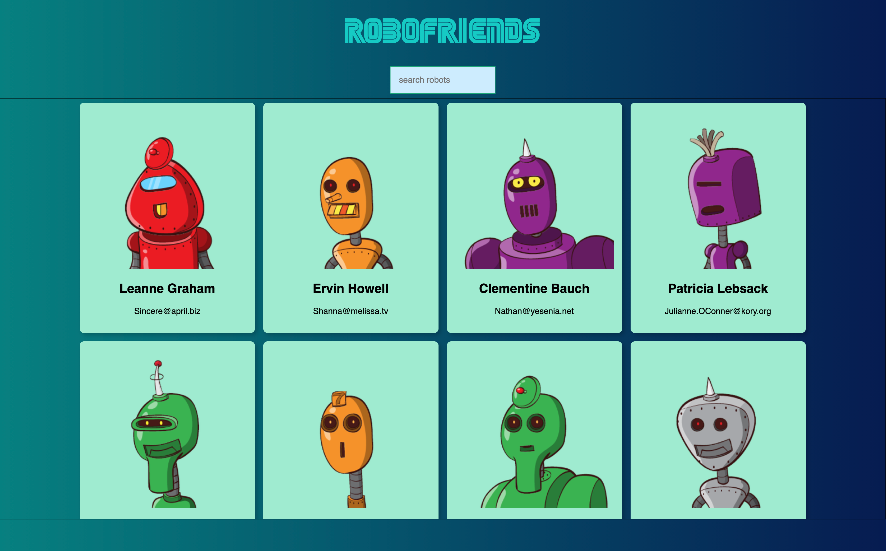
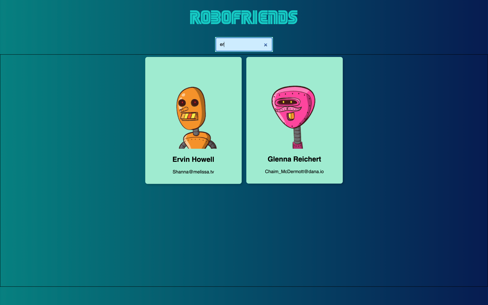

# RoboFriends

A react app that generates random robots directory from which a user can sort dynamically by robot's name. This is build using React

Screenshot of application:

Screenshot of dynamic sorting:

App is deployed to Heroku, [here](https://protected-thicket-18299.herokuapp.com/)

## Table of Contents

* [Installation](#Installation)
* [Usage](#Usage)
* [Contributing](#Contributing)
* [Tests](#Tests)
* [License](#License)
* [Questions](#Questions)

## Installation
To install, simply clone or download the repository. There are some NPM dependencies to keep in mind. Be sure to run the following:
Run npm install
Run npm start

## Usage
The app allows the user the ability to interact with the React application to dynamically sort through the directory.

## Contributing
We love seeing community contribution to any opensource project! If you would like to contribute, please do.

## Tests
none at the moment

## License
This project is released under BSD 2 Clause opensource license:

https://opensource.org/licenses/BSD-2-Clause

## Questions
For more about my work, check out my Github profile: https://github.com/nard1n

If you have any questions and would like to chat, please feel free to send me an email directly to nardincodes@gmail.com
